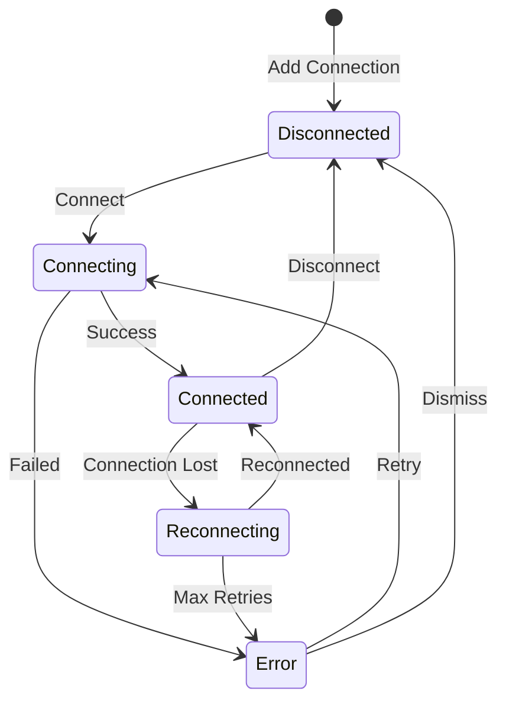

# Connections

Leafnode supports multiple simultaneous NATS server connections with secure credential storage.

## Adding a Connection

1. Click the **+** button in the Connections view title bar, or run **Leafnode: Add Connection** from the command palette
2. Enter a name for the connection
3. Enter the server URL(s), comma-separated for clusters
4. Select an authentication method
5. Optionally enter a monitoring URL (for the server dashboard)

## Authentication Methods

| Method | Description |
|--------|-------------|
| Anonymous | No authentication |
| Token | Bearer token |
| Username/Password | Basic auth |
| NKey | Ed25519 key pair |
| Credentials File | `.creds` file (JWT + NKey) |
| TLS Client Certificate | Mutual TLS |

All secrets are stored in VS Code's SecretStorage — never in plaintext settings.

## Connection Lifecycle

## Editing Connections

Right-click a connection in the tree and select **Edit Connection** to modify its settings.

## Monitoring URL

To use the Server Monitoring dashboard, set the monitoring URL (typically `http://localhost:8222`). This is the NATS HTTP monitoring port, not the client port.
