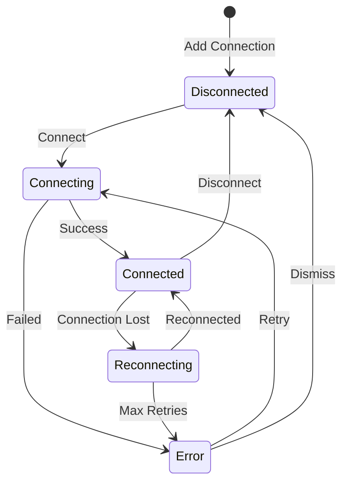

# Connections

Leafnode supports multiple simultaneous NATS server connections with secure credential storage.

## Adding a Connection

1. Click the **+** button in the Connections view title bar, or run **Leafnode: Add Connection** from the command palette
2. Enter a name for the connection
3. Enter the server URL(s), comma-separated for clusters
4. Select an authentication method
5. Optionally enter a monitoring URL (for the server dashboard)

## Authentication Methods

| Method | Description |
|--------|-------------|
| Anonymous | No authentication |
| Token | Bearer token |
| Username/Password | Basic auth |
| NKey | Ed25519 key pair |
| Credentials File | `.creds` file (JWT + NKey) |
| TLS Client Certificate | Mutual TLS |

All secrets are stored in VS Code's SecretStorage — never in plaintext settings.

## Connection Lifecycle

## Editing Connections

Right-click a connection in the tree and select **Edit Connection** to modify its settings.

## Export and Import Connections

You can export your saved connections as a JSON file and import them on another machine or share them with teammates.

- **Export**: Run **Leafnode: Export Connections** from the command palette. All connection configurations are saved to a JSON file (secrets are not included).
- **Import**: Run **Leafnode: Import Connections** from the command palette and select a previously exported JSON file.

This is useful for sharing connection profiles across machines or onboarding new team members.

## NATS_URL Environment Variable

Leafnode detects the `NATS_URL` environment variable on activation. If set, you can quickly create a connection from it:

1. Run **Leafnode: Import Connection from NATS_URL** from the command palette
2. If `NATS_URL` is set, a connection is created automatically using its value
3. If a connection for that URL already exists, Leafnode will let you know

This integrates naturally with environments where `NATS_URL` is set by container orchestration, `.env` files, or shell profiles.

## Health Check and RTT

Connected servers display their round-trip time (RTT) in the connection tree item description, e.g., `nats://localhost:4222 (2ms)`. The RTT is measured by pinging the server each time the connections tree refreshes.

## Per-Connection Context Menu

Right-click a connected server in the Connections tree to access:

- **Edit Connection** — modify the connection's settings
- **Disconnect** — disconnect from the server
- **Remove Connection** — delete the saved connection

Disconnected or errored connections show **Connect** in their context menu instead.

## Multi-Connection Behavior

Leafnode supports multiple simultaneous connections. When you have several servers connected, commands that operate on a specific connection (e.g., creating a stream or opening the Pub/Sub panel) use the connection associated with the relevant tree item context.

## Keyboard Shortcuts

| Shortcut | Command |
|----------|---------|
| `Ctrl+Shift+Alt+N` (`Cmd+Shift+Alt+N` on macOS) | Add Connection |

## Monitoring URL

To use the Server Monitoring dashboard, set the monitoring URL (typically `http://localhost:8222`). This is the NATS HTTP monitoring port, not the client port.
