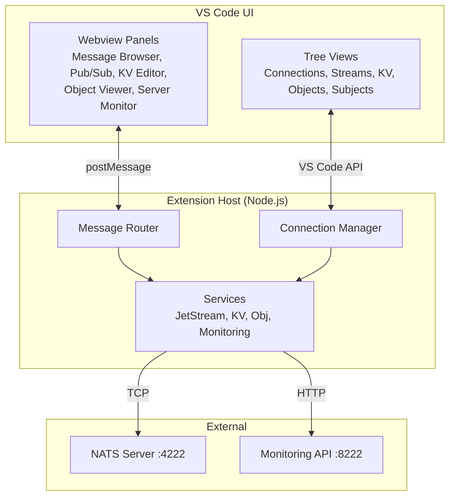

# Getting Started

## Installation

Install Leafnode from the [VS Code Marketplace](https://marketplace.visualstudio.com/items?itemName=ottercoders.leafnode) or search for "Leafnode" in the Extensions view.

## Prerequisites

- A running NATS server (with JetStream enabled for stream/KV features)
- VS Code 1.95.0 or later

## Quick Start

1. Click the **NATS** icon in the Activity Bar to open the Leafnode sidebar
2. Click **Add Connection** or **Import from NATS CLI**
3. Enter your server URL (default: `nats://localhost:4222`)
4. Click Connect

Once connected, you'll see your streams, KV stores, and object stores populate in the sidebar tree views.

## Architecture

Leafnode runs as a **workspace extension** — it executes on the same machine as your workspace. All NATS communication uses TCP from the extension host, which means it works in remote environments (SSH, WSL, Codespaces).



## Running NATS Locally

The quickest way to get a NATS server running with JetStream:

```bash
docker run -p 4222:4222 -p 8222:8222 nats:latest -js -m 8222
```

This starts NATS with:
- **4222** — client connections
- **8222** — HTTP monitoring (for the server dashboard)
- **JetStream** enabled for streams, KV, and object stores

## Importing NATS CLI Contexts

If you already use the NATS CLI, Leafnode can import your saved contexts:

1. Open the command palette (`Ctrl+Shift+P`)
2. Run **Leafnode: Import NATS CLI Contexts**
3. Select which contexts to import

Contexts are read from `~/.config/nats/context/*.json`. Credentials are stored securely in VS Code's SecretStorage.
