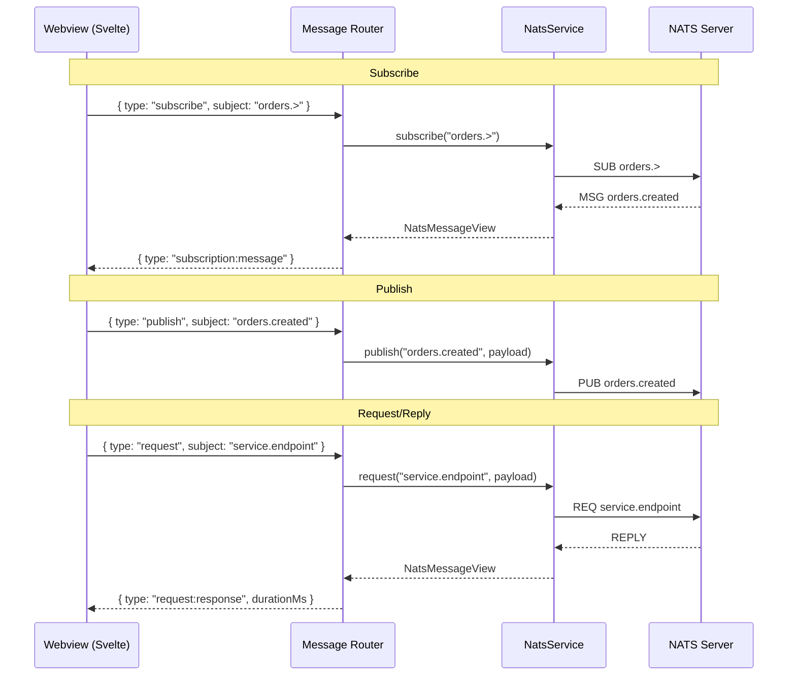

# Pub/Sub

The Pub/Sub panel provides interactive publish, subscribe, and request/reply.

## Opening

Click the **radio tower** icon in the Streams view title bar, or run **Leafnode: Open Pub/Sub Panel** from the command palette.

**Keyboard shortcut:** `Ctrl+Shift+Alt+M` (`Cmd+Shift+Alt+M` on macOS).

## Subscribe Tab

- Enter a subject with wildcard support (`*`, `>`)
- Click **Subscribe** to start receiving messages
- Messages appear in a virtual-scrolled feed with color-coded subjects
- **Pause/Resume** — freeze the display without unsubscribing
- **Filter** — regex filter on subject or payload
- **Export** — save captured messages as JSON
- **Save** — bookmark subscriptions for quick re-use (star icon)

Multiple simultaneous subscriptions are supported, each color-coded.

Enter a regex pattern in the filter box to filter messages by subject or payload content. The count shows how many messages match out of the total.

A real-time rate indicator shows messages per second.

Each subscription is color-coded. Messages in the feed show their subscription's color for easy visual grouping.

Click **Export** to save all captured messages as a JSON file.

Click the star icon next to a subscription to save it. See [Bookmarks](/guide/bookmarks) for details.

## Publish Tab

- Enter a subject and payload
- Add custom headers
- Save frequently-used payloads as templates
- Templates persist across sessions

To save a template, fill in the subject, headers, and payload, then click **Save Template**. Saved templates appear at the top of the Publish tab and can be loaded with a single click. See [Bookmarks](/guide/bookmarks) for more on templates and saved subscriptions.

## Request Tab

- Send a request and view the response with round-trip timing
- Configurable timeout (default 5 seconds)

## Message Flow

